<div align="center">
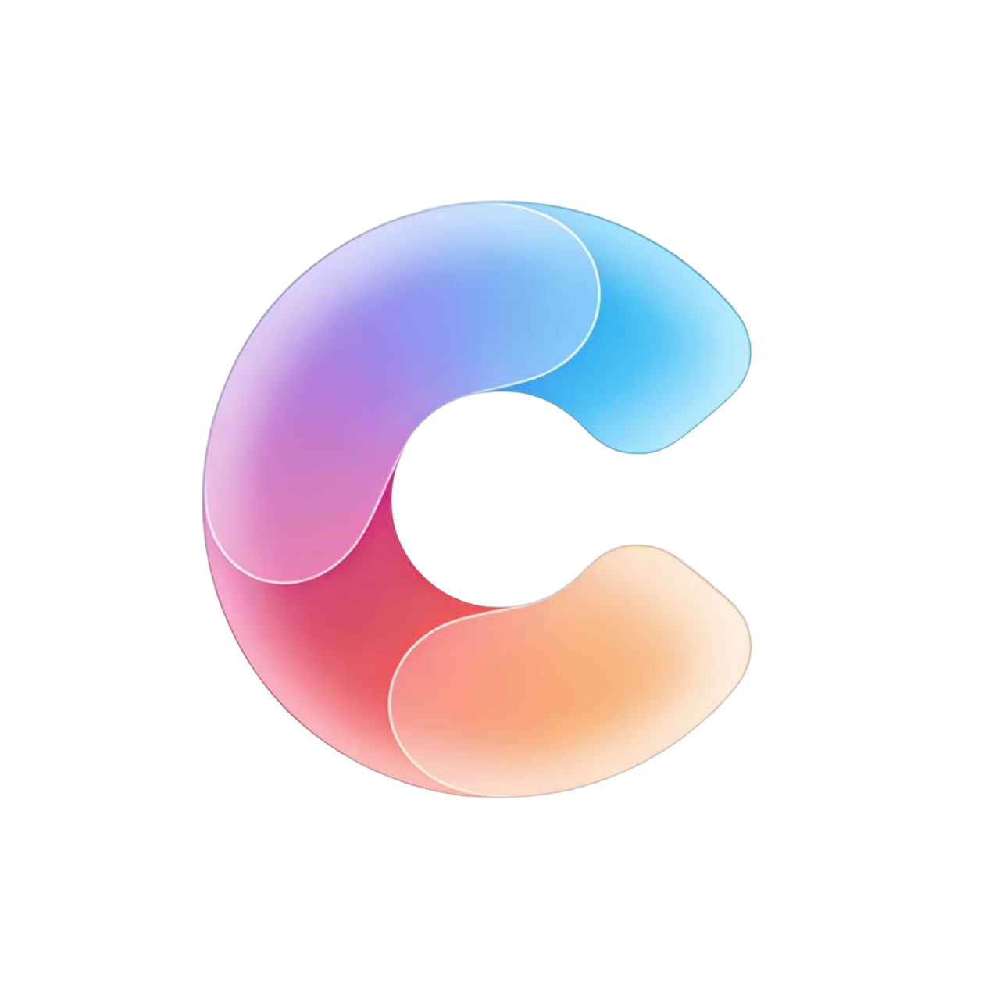
<h1>Constella</h1>
<p>A real-time collaborative infinite canvas for structured knowledge and externalized thinking</p>

[中文](./README.md) | [English](./README-en.md)

[Backend Core](https://github.com/TiiJeiJ8/Constella_CORE) | [User Guide](docs/USER_GUIDE-en.md) | [Editor Guide](docs/EDITOR_GUIDE.md) | [Plugin Development](docs/PLUGIN_DEVELOPMENT_ARCHITECTURE_4.0.md)

<br />

[Contributing](./CONTRIBUTING.md) | [Security](./SECURITY.md) | [Code of Conduct](./CODE_OF_CONDUCT.md)

<br />

[](https://github.com/TiiJeiJ8/constella/stargazers)
[](https://github.com/TiiJeiJ8/constella/issues)
[](./LICENSE)
[](https://github.com/TiiJeiJ8/constella/commits)

</div>

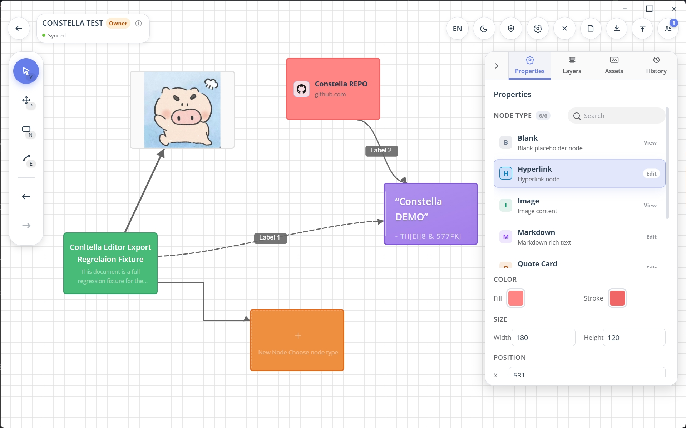

## Overview

> [!IMPORTANT]
>
> ### Project Scope
>
> - This repository is the frontend of Constella (Web + Electron). The backend is [Constella_CORE](https://github.com/TiiJeiJ8/Constella_CORE)
> - Constella focuses on structure-first knowledge expression instead of linear documents
> - The project is actively evolving; contributions via Issues and PRs are welcome

> [!NOTE]
> - **Running from source requires Node.js**
> - **Desktop releases (installer/zip) include Node.js, no extra installation needed for end users**

- Stack: Vue 3 + TypeScript + Vite + Electron + Yjs
- Runtime: modern browsers and Electron desktop
- Collaboration: CRDT-based real-time sync via Yjs + y-websocket
- Setup: backend URL is entered on the home page and persisted locally

## 🧑‍💻 Development

### Quick Start

1. Use Node.js 22.12.0 for development and building from source
2. Install dependencies: `npm install`
3. Start Web dev server: `npm run dev`
4. Start Electron dev mode: `npm run dev:electron`
5. Build Web assets: `npm run build`

### Build Desktop Package

- Run `npm run version:bump -- 1.x.x` to update version number before building
- This command updates `web/package.json` and `web/package-lock.json`, then tries to sync `../server/package.json` and `../server/package-lock.json`
- If the `server` folder or backend version files are missing, backend sync is skipped automatically and frontend bump still succeeds
- Run `npm run build:electron:release` for production build (generates both installer and zip)
- Run `npm run build:electron:installer` for installer version
- Run `npm run build:electron:zip` for zip version
- Build artifacts are generated in `dist-electron/`

### Collaboration Address Configuration

- WebSocket URL is derived automatically from your backend URL
- You can override it in `.env.development` with `VITE_WS_URL=localhost:3000`

## 🎉 Features

- 🧭 Infinite canvas: nodes, edges, free dragging, zooming
- 🤝 Real-time collaboration: multi-user synchronous editing
- 🧩 Plugin-based node system: Text / Markdown / Image / Hyperlink and more. Installing Node Plugin is available now.
- 🔐 Room Permission Control: Clearly Distinguish Member Roles and Collaboration Boundaries
- 🌍 i18n and theming: Chinese/English + light/dark
- 💾 Persistence: IndexedDB (Web) + electron-store (desktop)

## Plugin Development and Installation

Constella now supports both built-in node plugins and installable runtime plugins.

- Built-in official plugins live in `src/plugins/`
- End-user plugin distribution should use `.constella-plugin` as the primary format, with `.zip` as a compatibility format
- Development plugins can still be loaded from a plugin folder during local iteration
- `manifest.json` is the entry file inside a plugin folder, not a standalone plugin package
- Built-in plugins, user-installed plugins, and development plugins should be kept as separate layers
- Plugin management is available in both `Settings -> Plugins` and the room dock plugin panel
- The plugin panel defaults to end-user package installation flow; development plugin loading is shown only when Developer Mode is enabled in Settings
- Turning Developer Mode off hides development plugin entry points and prevents development plugins from being loaded at runtime, while keeping their records for later reuse
- Installed user plugins are persisted under Electron user data, so they remain after restarting the desktop app

See:

- [Plugin Package Format](docs/PLUGIN_PACKAGE_FORMAT.md)
- [Plugin Development Architecture 4.0](docs/PLUGIN_DEVELOPMENT_ARCHITECTURE_4.0.md)

## 🖼️ Screenshots

<details>
<summary> Canvas Collaboration Demo </summary>

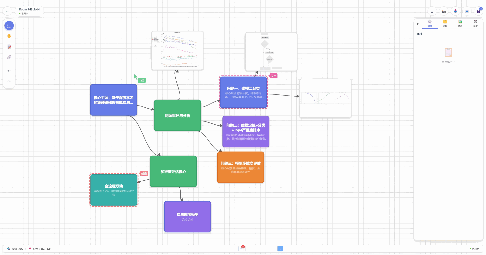

</details>

<details>
<summary> Dark & Light Mode </summary>

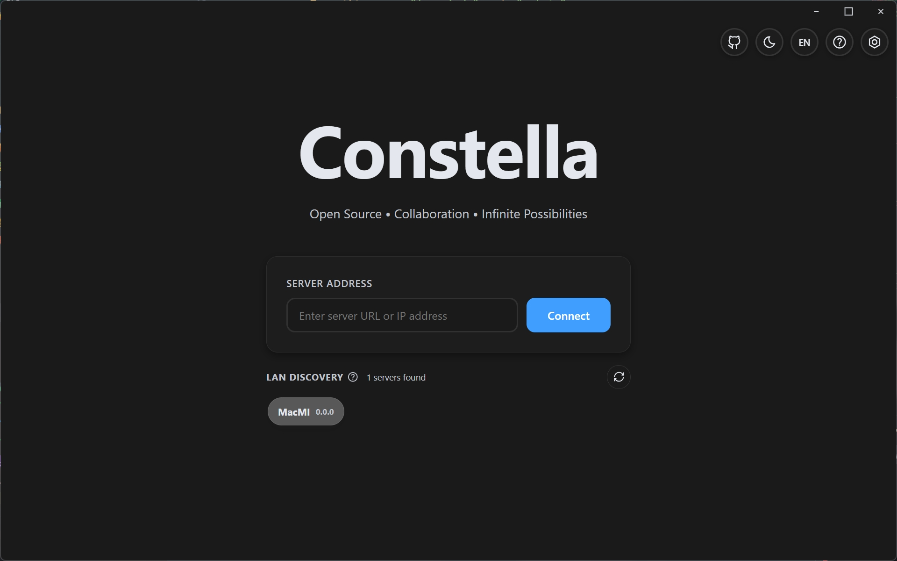
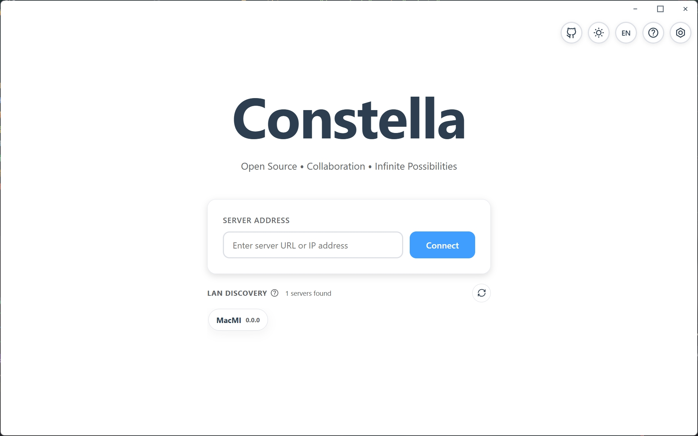

</details>

<details>
<summary> Room Page </summary>

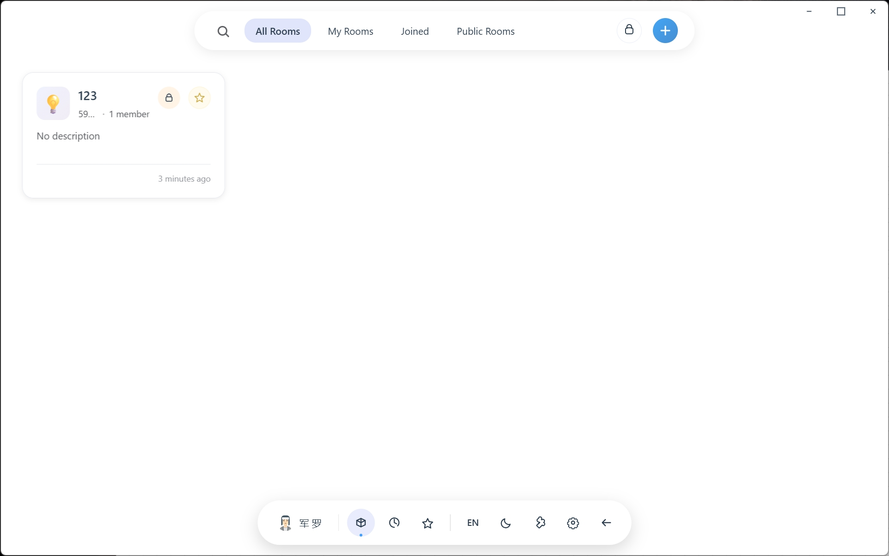

</details>

<details>
<summary> Create Room </summary>

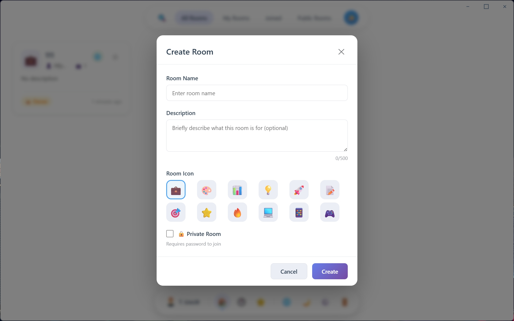

</details>

<details>
<summary> Editor Demo </summary>

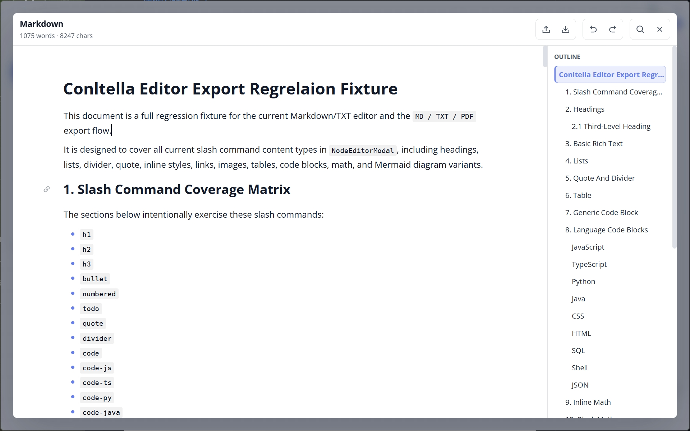

</details>

<details>
<summary> Plugin Panel </summary>

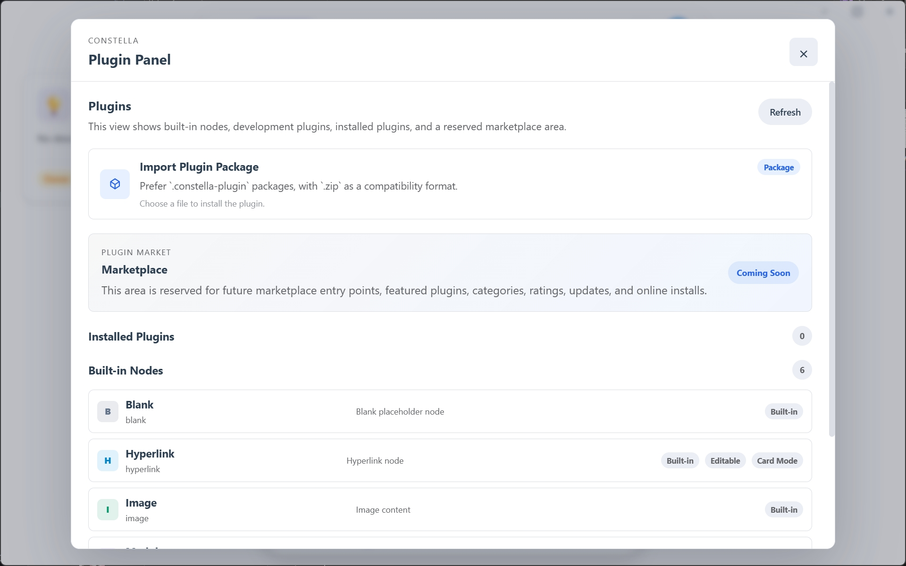
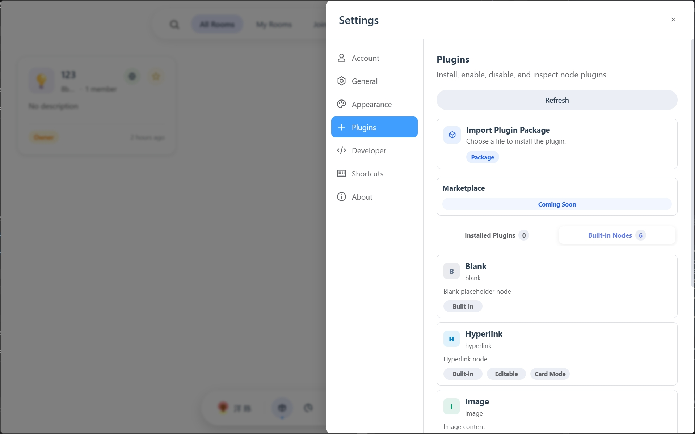

</details>

<details>
<summary> Plugin Development </summary>

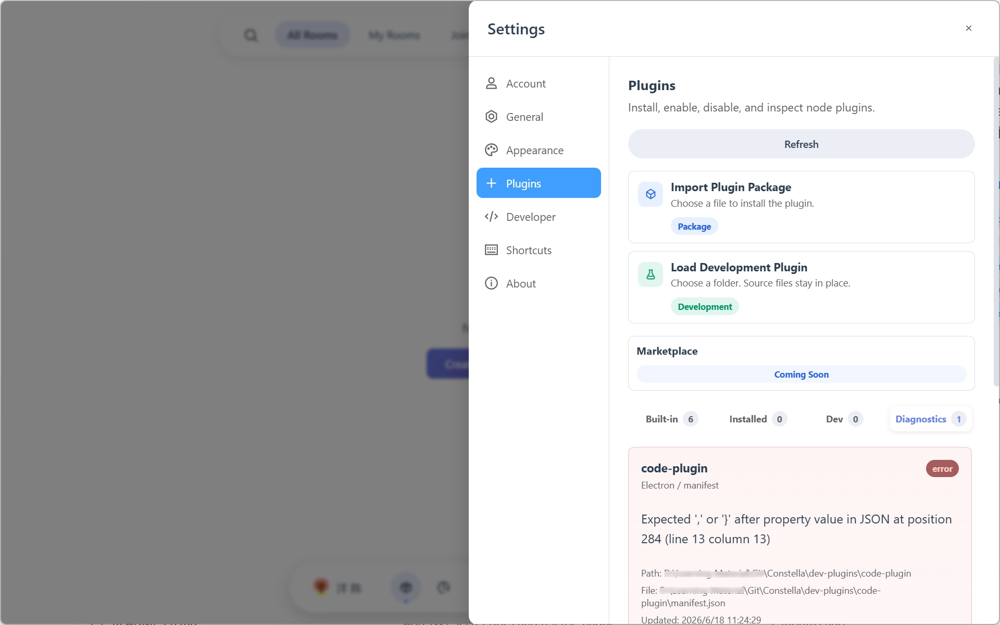

</details>

## 📦️ Distribution

### Run from Source

```bash
git clone https://github.com/TiiJeiJ8/constella.git
cd web
npm install
npm run dev
```

### Build Artifacts

- Web build: `npm run build` outputs to `dist/`
- Electron package: `npm run build:electron` (includes built-in Node runtime)

### Deployment Notes

- Frontend can be deployed as static assets (Nginx/Caddy/any static hosting)
- For backend setup, refer to [Constella_CORE](https://github.com/TiiJeiJ8/Constella_CORE)

## 📁 Project Structure

```text
src/
├─ components/      # Shared UI components
├─ plugins/         # Node plugins
├─ composables/     # Reusable composition logic
├─ services/        # API and collaboration services
├─ locales/         # i18n resources
├─ views/           # Page-level views
└─ assets/          # Static assets

electron/           # Electron main/preload process
public/             # Public assets
docs/               # Usage and development docs
```

## 🤝 Contributing

Contributions are welcome:

- Open Issues for bugs, discussions, and proposals
- Submit PRs for features, fixes, docs, and tests
- Support long-term iteration via Stars and Forks

<a href="https://github.com/TiiJeiJ8/constella/graphs/contributors" target="_blank" rel="noopener">
  
</a>

## 📢 Disclaimer

This project is under active development. Some features and interfaces may change. Please evaluate and test thoroughly before production use.

## 📜 License

This project is licensed under [MIT License](./LICENSE).

## ⭐ Star History

<a href="https://www.star-history.com/?repos=TiiJeiJ8%2Fconstella&type=timeline&legend=bottom-right">
 <picture>
   <source media="(prefers-color-scheme: dark)" srcset="https://api.star-history.com/image?repos=TiiJeiJ8/constella&type=timeline&theme=dark&legend=bottom-right" />
   <source media="(prefers-color-scheme: light)" srcset="https://api.star-history.com/image?repos=TiiJeiJ8/constella&type=timeline&legend=bottom-right" />
   
 </picture>
</a>
