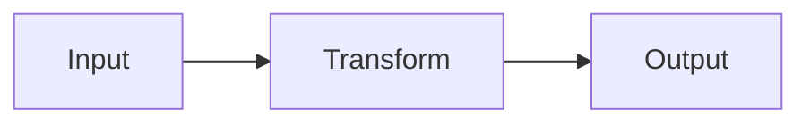
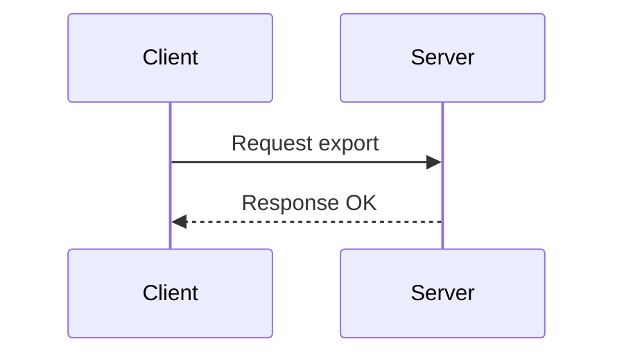
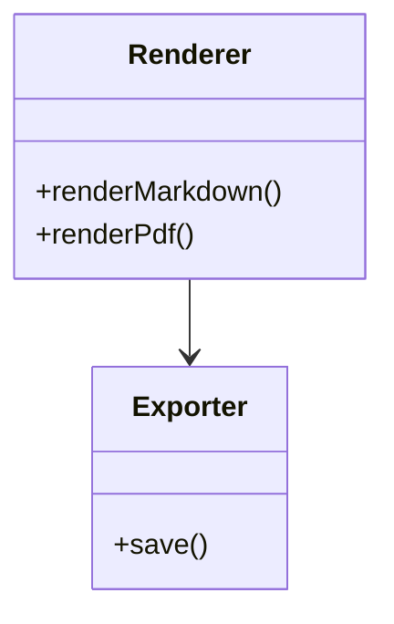
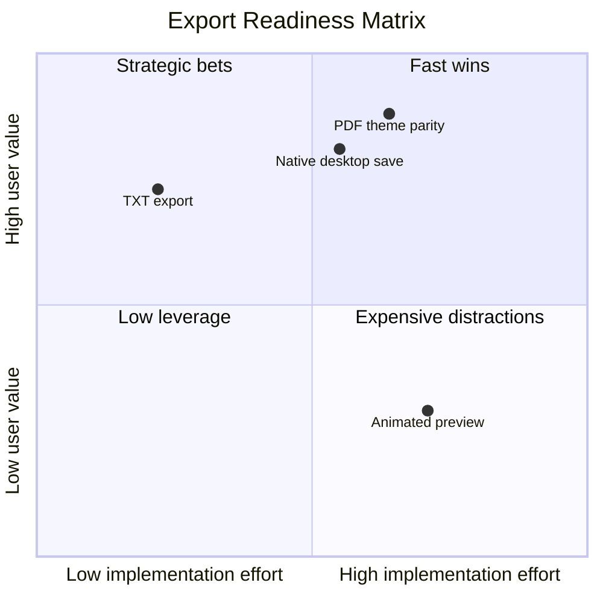

# Constella Editor Export Stress Fixture

This document is designed to stress-test the editor preview and the `MD / TXT / PDF` export pipeline with edge cases that are more likely to reveal layout, pagination, wrapping, rendering, and fallback problems.

## 1. Very Long Paragraph

This paragraph is intentionally long and dense so you can inspect how the editor preview, TXT export, and PDF export handle long continuous prose across multiple visual lines and potentially multiple pages. It should help verify line wrapping, paragraph spacing, text readability, page breaks, and whether exported output preserves a stable rhythm rather than collapsing whitespace, clipping text, or inserting awkward visual jumps between lines and sections when content becomes large enough to stress the layout engine under real-world export conditions.

## 2. Multi-Page Paragraph Block

Lorem ipsum dolor sit amet, consectetur adipiscing elit. Sed non neque at justo vulputate mattis. Cras tincidunt, sem nec luctus elementum, nibh ligula facilisis metus, sit amet efficitur velit augue a erat. Vestibulum ante ipsum primis in faucibus orci luctus et ultrices posuere cubilia curae; Integer tempor, sapien ut viverra tristique, nisl est cursus ligula, non suscipit metus nisi nec nibh. Donec finibus, orci nec pellentesque sollicitudin, sem sapien volutpat nibh, id hendrerit enim justo sed risus.

Lorem ipsum dolor sit amet, consectetur adipiscing elit. Sed non neque at justo vulputate mattis. Cras tincidunt, sem nec luctus elementum, nibh ligula facilisis metus, sit amet efficitur velit augue a erat. Vestibulum ante ipsum primis in faucibus orci luctus et ultrices posuere cubilia curae; Integer tempor, sapien ut viverra tristique, nisl est cursus ligula, non suscipit metus nisi nec nibh. Donec finibus, orci nec pellentesque sollicitudin, sem sapien volutpat nibh, id hendrerit enim justo sed risus.

Lorem ipsum dolor sit amet, consectetur adipiscing elit. Sed non neque at justo vulputate mattis. Cras tincidunt, sem nec luctus elementum, nibh ligula facilisis metus, sit amet efficitur velit augue a erat. Vestibulum ante ipsum primis in faucibus orci luctus et ultrices posuere cubilia curae; Integer tempor, sapien ut viverra tristique, nisl est cursus ligula, non suscipit metus nisi nec nibh. Donec finibus, orci nec pellentesque sollicitudin, sem sapien volutpat nibh, id hendrerit enim justo sed risus.

Lorem ipsum dolor sit amet, consectetur adipiscing elit. Sed non neque at justo vulputate mattis. Cras tincidunt, sem nec luctus elementum, nibh ligula facilisis metus, sit amet efficitur velit augue a erat. Vestibulum ante ipsum primis in faucibus orci luctus et ultrices posuere cubilia curae; Integer tempor, sapien ut viverra tristique, nisl est cursus ligula, non suscipit metus nisi nec nibh. Donec finibus, orci nec pellentesque sollicitudin, sem sapien volutpat nibh, id hendrerit enim justo sed risus.

## 3. Extremely Wide Table

| ID | Name | Category | Description | Status | Priority | Owner | Created At | Updated At | Notes |
| --- | --- | --- | --- | --- | --- | --- | --- | --- | --- |
| 1 | Export Pipeline | Infrastructure | A very long description intended to see whether table cells wrap nicely in preview and PDF without overflowing outside the page container or destroying horizontal layout balance. | Active | High | Alice | 2026-03-01 09:00 | 2026-03-25 11:00 | Should remain readable |
| 2 | Markdown Render | Frontend | Another long table row that includes enough text to force wrapping in multiple columns and expose any border or alignment defects in exported PDF rendering. | Reviewing | Medium | Bob | 2026-03-02 10:30 | 2026-03-25 11:10 | Verify line wrapping |
| 3 | TXT Fallback | Export | Plain text export should remain understandable even if the table loses its original shape and becomes a more linear representation. | Planned | Low | Carol | 2026-03-03 14:15 | 2026-03-25 11:20 | Check degradation |

## 4. Extremely Long Code Line

```javascript
const absurdlyLongSingleLine = "This_is_a_deliberately_long_single_line_value_used_to_test_horizontal_overflow_behavior_in_preview_and_pdf_export_without_manual_line_breaks_or_soft_wrapping_being_inserted_by_the_author_so_that_we_can_see_how_the_renderer_handles_extreme_width_conditions_in_code_blocks_1234567890_abcdefghijklmnopqrstuvwxyz_REPEAT_REPEAT_REPEAT_REPEAT_REPEAT";
```

## 5. Large Mixed-Language Code Sample

```typescript
type ExportFormat = "md" | "txt" | "pdf";

interface ExportScenario {
  id: string;
  title: string;
  format: ExportFormat;
  expected: {
    shouldPreserveHeading: boolean;
    shouldRenderMermaid: boolean;
    shouldKeepCodeFormatting: boolean;
  };
}

const scenarios: ExportScenario[] = [
  {
    id: "scenario-001",
    title: "Markdown raw export",
    format: "md",
    expected: {
      shouldPreserveHeading: true,
      shouldRenderMermaid: false,
      shouldKeepCodeFormatting: true
    }
  },
  {
    id: "scenario-002",
    title: "Plain text export",
    format: "txt",
    expected: {
      shouldPreserveHeading: true,
      shouldRenderMermaid: false,
      shouldKeepCodeFormatting: false
    }
  },
  {
    id: "scenario-003",
    title: "PDF export",
    format: "pdf",
    expected: {
      shouldPreserveHeading: true,
      shouldRenderMermaid: true,
      shouldKeepCodeFormatting: true
    }
  }
];

for (const scenario of scenarios) {
  console.log(`${scenario.id}: ${scenario.title} -> ${scenario.format}`);
}
```

## 6. Consecutive Mermaid Blocks







## 7. Complex Mermaid Diagram



## 8. Image Success And Failure Cases

Working image:


Broken image:


## 9. Dense Math

Inline math stress:

$f(x)=\sum_{n=0}^{\infty}\frac{x^n}{n!}$, $e^{i\pi}+1=0$, and $P(A\mid B)=\frac{P(B\mid A)P(A)}{P(B)}$.

Block math stress:

$$
\mathbf{X}^{(k+1)} = \mathbf{W}\mathbf{X}^{(k)} + \mathbf{b}, \quad
\mathcal{L}(\theta) = -\sum_{i=1}^{N} y_i \log \hat{y}_i + \lambda \lVert \theta \rVert_2^2
$$

$$
\left[
\begin{matrix}
1 & 2 & 3 \\
4 & 5 & 6 \\
7 & 8 & 9
\end{matrix}
\right]
\cdot
\left[
\begin{matrix}
\alpha \\
\beta \\
\gamma
\end{matrix}
\right]
=
\left[
\begin{matrix}
\delta \\
\varepsilon \\
\zeta
\end{matrix}
\right]
$$

## 10. Quote Nesting Feel Test

> Level one quote line one.
> Level one quote line two with `inline code`.
>
> Still level one, but separated by a blank quoted line.

## 11. Divider Repetition

---

Paragraph between dividers to verify spacing.

---

Another paragraph between dividers to verify consistency.

---

## 12. Mixed Inline Stress

This sentence intentionally mixes **bold**, *italic*, ~~strike~~, `code`, [link](https://example.com), and $a^2+b^2=c^2$ all together so you can inspect whether line height, inline alignment, and export sanitization remain stable.

## 13. Deep Heading Pagination Test

### Section A

Content for section A.

### Section B

Content for section B.

### Section C

Content for section C.

### Section D

Content for section D.

### Section E

Content for section E.

### Section F

Content for section F.

### Section G

Content for section G.

### Section H

Content for section H.

## 14. TXT Degradation Check

When exported as TXT, verify these edge-case expectations:

- Very wide tables should remain understandable even if formatting collapses.
- Broken images should not crash export.
- Mermaid blocks should degrade into readable source text if they do not render as diagrams in TXT.
- Long code lines should remain intact.
- Long paragraphs should preserve reading order.

## 15. Final Stress Checklist

Use this file to verify:

- Preview remains responsive with heavy content.
- PDF export handles multiple pages.
- PDF export handles multiple Mermaid blocks in one document.
- PDF export does not clip long code lines unexpectedly.
- PDF export handles both valid and broken images gracefully.
- TXT export remains readable under extreme formatting pressure.
- MD export preserves the original source without corruption.
