# Constella Editor Export Regression Fixture

This document is a full regression fixture for the current Markdown/TXT editor and the `MD / TXT / PDF` export flow.

It is designed to cover all current slash command content types in `NodeEditorModal`, including headings, lists, divider, quote, inline styles, links, images, tables, code blocks, math, and Mermaid diagram variants.

## 1. Slash Command Coverage Matrix

The sections below intentionally exercise these slash commands:

- `h1`
- `h2`
- `h3`
- `bullet`
- `numbered`
- `todo`
- `quote`
- `divider`
- `code`
- `code-js`
- `code-ts`
- `code-py`
- `code-java`
- `code-css`
- `code-html`
- `code-sql`
- `code-sh`
- `code-json`
- `math`
- `math-block`
- `mermaid-flow`
- `mermaid-seq`
- `mermaid-mindmap`
- `mermaid-class`
- `mermaid-state`
- `mermaid-er`
- `mermaid-gantt`
- `mermaid-journey`
- `mermaid-pie`
- `mermaid-gitgraph`
- `mermaid-timeline`
- `mermaid-quadrant`
- `mermaid-requirement`
- `bold`
- `italic`
- `strike`
- `link`
- `image`
- `table`

## 2. Headings

### 2.1 Third-Level Heading

This subsection validates the `h3` slash command and heading nesting.

## 3. Basic Rich Text

This paragraph checks plain body text rendering, line wrapping, punctuation, and mixed inline syntax.

Here is **bold text** using the `bold` command.

Here is *italic text* using the `italic` command.

Here is ~~strikethrough text~~ using the `strike` command.

Here is `inline code` inside a normal paragraph.

Here is a hyperlink created with the `link` command: [OpenAI](https://openai.com).

Here is an image created with the `image` command:


## 4. Lists

- Bullet item A
- Bullet item B
- Bullet item C

1. Numbered item one
2. Numbered item two
3. Numbered item three

- [ ] Todo item not done
- [x] Todo item completed

## 5. Quote And Divider

> This is a blockquote produced by the `quote` slash command.
> It should preserve indentation, spacing, and quote styling in preview and PDF export.

---

## 6. Table

| Column 1 | Column 2 | Column 3 |
| --- | --- | --- |
| Alpha | Beta | Gamma |
| 123 | 456 | 789 |
| Long content cell | Text with **formatting** | `code` |

## 7. Generic Code Block

```
Plain fenced code block
without language annotation
to validate the generic `code` slash command.
```

## 8. Language Code Blocks

### JavaScript

```javascript
function greet(name) {
  const message = `Hello, ${name}!`;
  console.log(message);
  return message;
}

greet("Constella");
```

### TypeScript

```typescript
interface ExportResult {
  format: "md" | "txt" | "pdf";
  success: boolean;
}

const result: ExportResult = {
  format: "pdf",
  success: true
};
```

### Python

```python
def fibonacci(n: int) -> list[int]:
    values = [0, 1]
    while len(values) < n:
        values.append(values[-1] + values[-2])
    return values[:n]

print(fibonacci(8))
```

### Java

```java
public class ExportCheck {
    public static void main(String[] args) {
        System.out.println("PDF export ready");
    }
}
```

### CSS

```css
.export-card {
  border-radius: 16px;
  background: linear-gradient(135deg, #1e293b, #334155);
  color: #e5eefc;
}
```

### HTML

```html
<section class="export-card">
  <h1>Export Preview</h1>
  <p>HTML block for renderer validation.</p>
</section>
```

### SQL

```sql
SELECT id, title, exported_at
FROM documents
WHERE format = 'pdf'
ORDER BY exported_at DESC;
```

### Shell

```bash
npm install
npm run build
npx vue-tsc -b
```

### JSON

```json
{
  "document": "export-test",
  "formats": ["md", "txt", "pdf"],
  "success": true
}
```

## 9. Inline Math

Einstein's famous equation is $E = mc^2$.

The quadratic formula can be written as $x = \frac{-b \pm \sqrt{b^2 - 4ac}}{2a}$.

## 10. Block Math

$$
\int_a^b f(x)\,dx = F(b) - F(a)
$$

$$
\nabla \cdot \vec{E} = \frac{\rho}{\varepsilon_0}
$$

## 11. Mermaid Flowchart

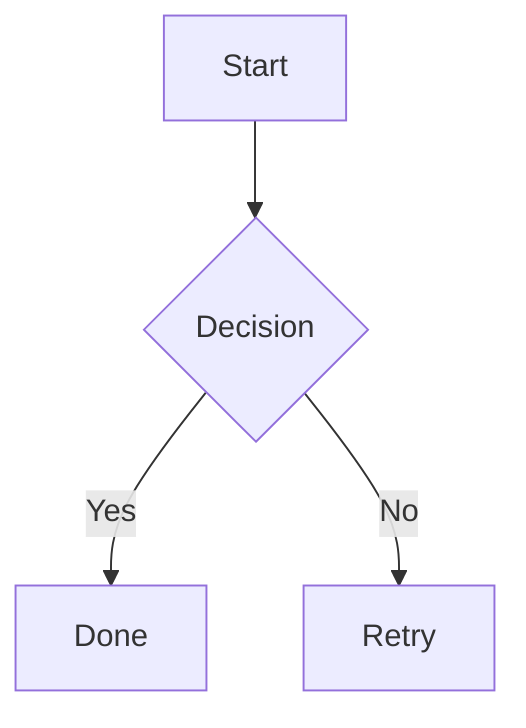

## 12. Mermaid Sequence Diagram

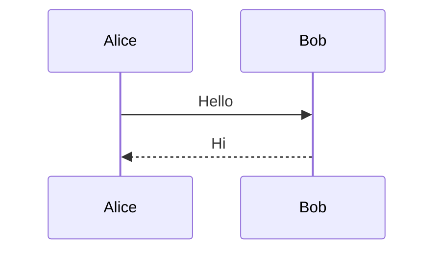

## 13. Mermaid Mindmap

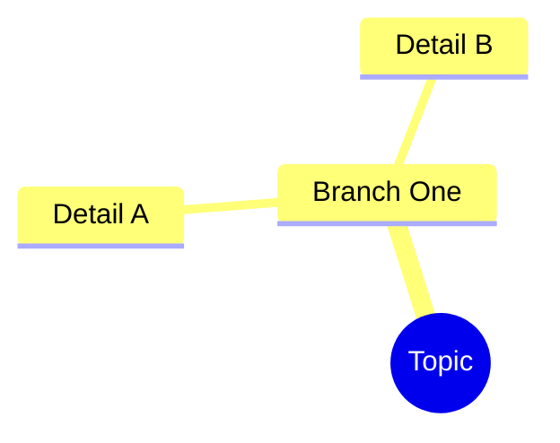

## 14. Mermaid Class Diagram

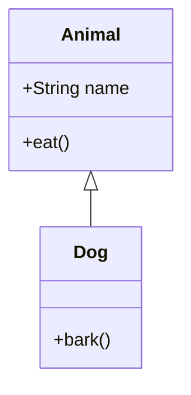

## 15. Mermaid State Diagram

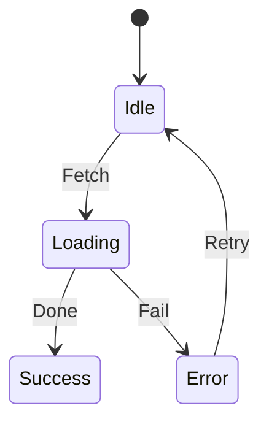

## 16. Mermaid ER Diagram

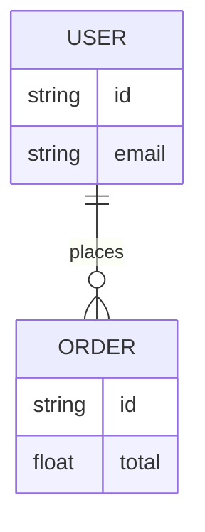

## 17. Mermaid Gantt Chart

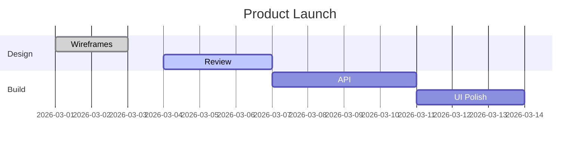

## 18. Mermaid Journey Map

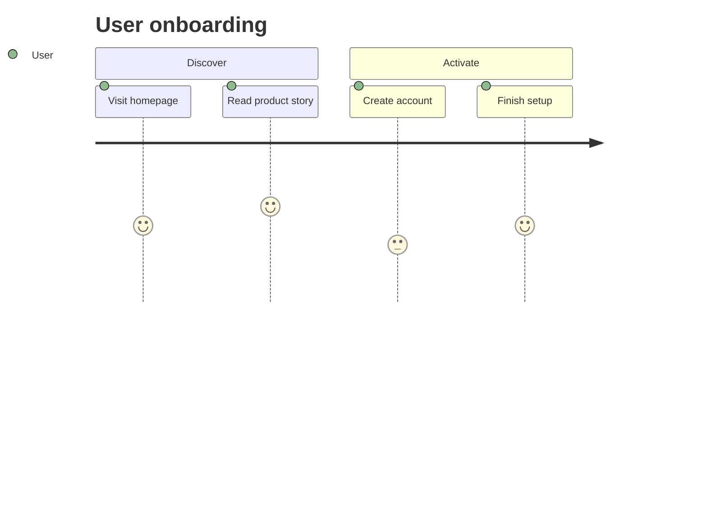

## 19. Mermaid Pie Chart

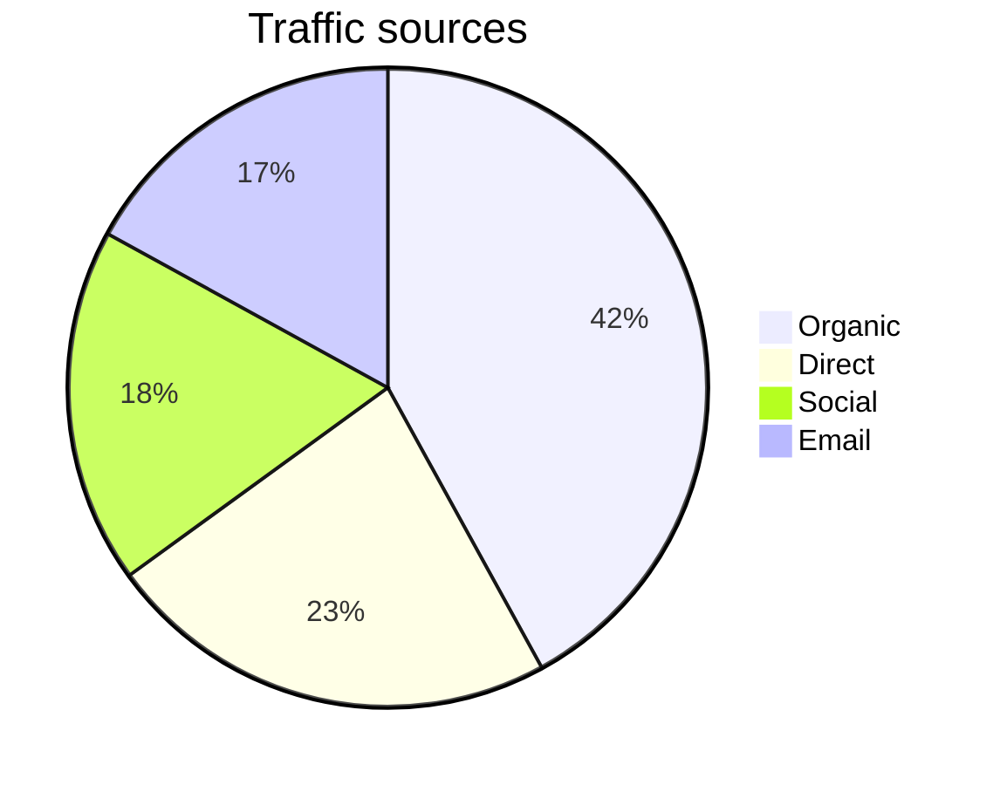

## 20. Mermaid Git Graph

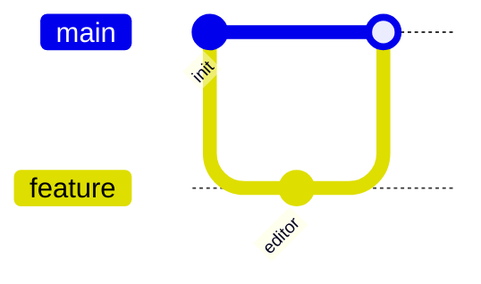

## 21. Mermaid Timeline

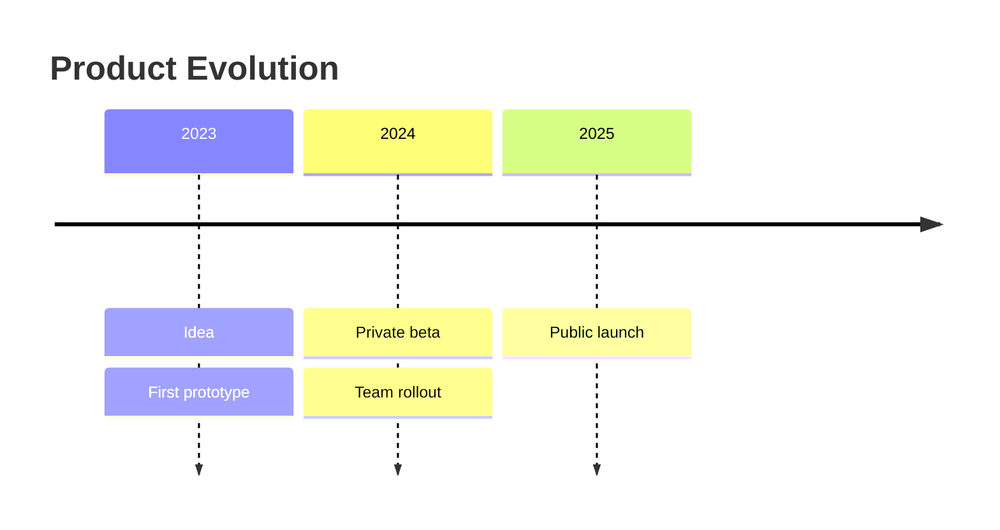

## 22. Mermaid Quadrant Chart

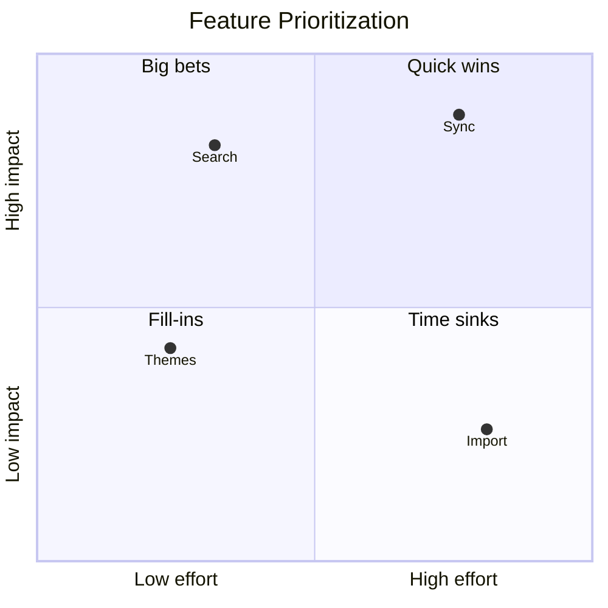

## 23. Mermaid Requirement Diagram

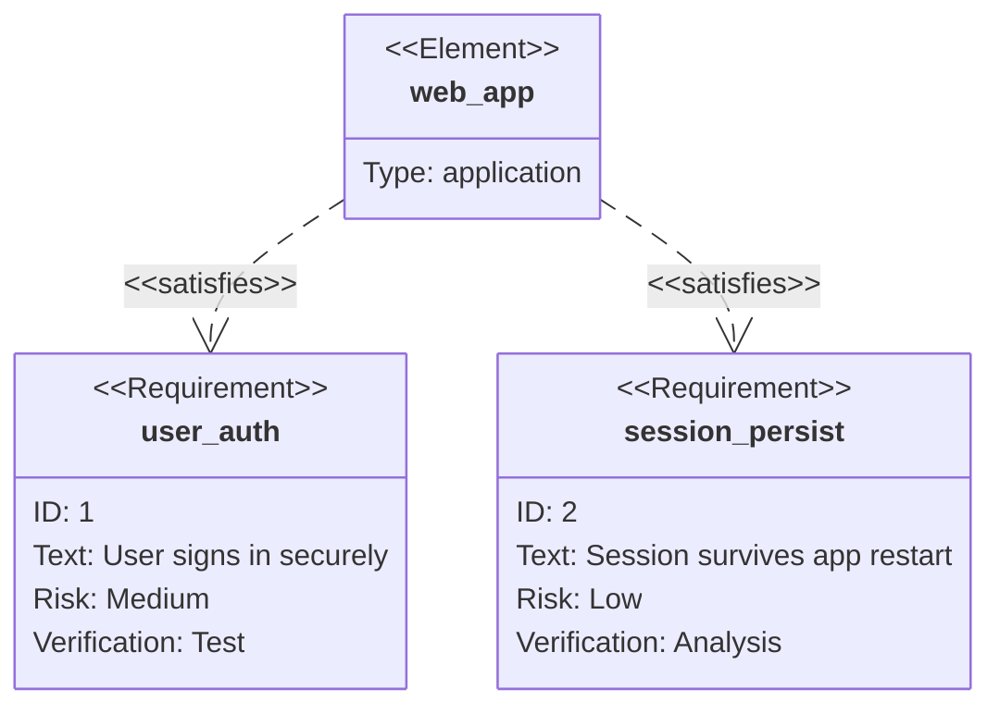

## 24. Escaping And Mixed Content

Special characters: `<tag>`, `&`, `"quoted text"`, and backticks inside code should remain safe.

Mixed sentence with link, code, and math: use [docs](https://example.com), inspect `exportDocument()`, and verify $a^2+b^2=c^2$.

## 25. Long Paragraph Stress Test

This section exists to test long-form paragraph wrapping in preview, PDF rendering, and TXT extraction. It intentionally includes enough text to span multiple visual lines so you can confirm spacing, alignment, readability, and whether exported output preserves a natural reading rhythm without clipping, collapsing, or introducing awkward breaks across lines and pages.

## 26. TXT Export Expectations

When exporting as TXT, you should verify:

- The document remains readable without excessive Markdown syntax noise.
- Headings are still understandable as plain text.
- Code blocks become readable plain text.
- Tables degrade acceptably into plain text.
- Mermaid and math content remain preserved as readable text or formula placeholders, depending on the export behavior.

## 27. Final Check

If this document exports successfully to:

- `.md`, the raw Markdown structure should remain intact.
- `.txt`, the content should still be readable in plain text form.
- `.pdf`, layout, code highlighting, formulas, image rendering, and Mermaid diagrams should render cleanly.
