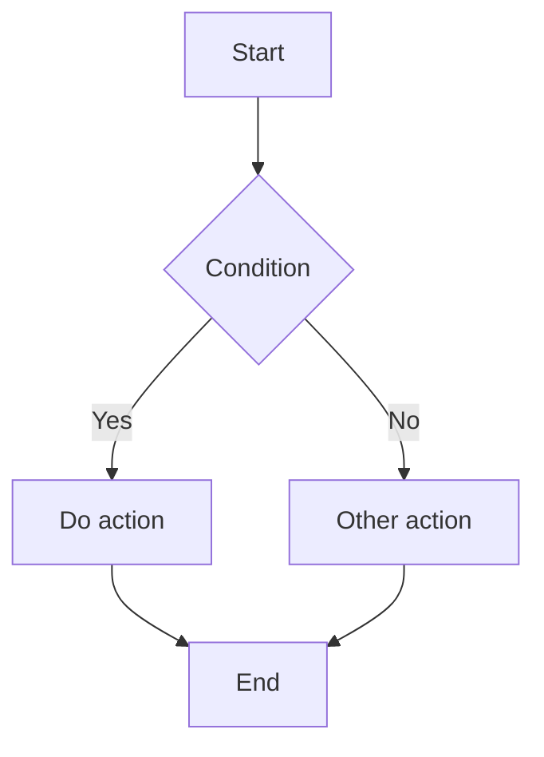
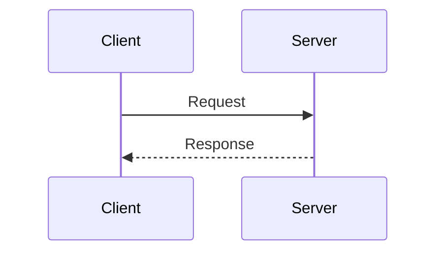
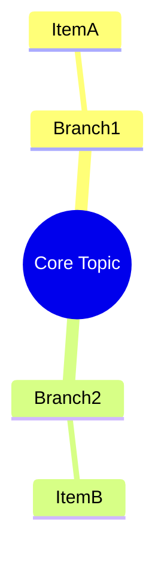

# Constella Editor Guide

This guide covers the current editor capabilities in the Constella canvas, including:

- Markdown / Text editing
- Slash commands and structured insertion
- Preview rendering and large-document experience
- Math formulas, Mermaid, and code highlighting
- Collaboration cursors, export, and high-frequency shortcuts

---

## Table of Contents

- [Editor Interface and Modes](#editor-interface-and-modes)
- [Input Experience and Smart Editing](#input-experience-and-smart-editing)
- [Slash Commands (/)](#slash-commands-)
- [Toolbar and Structured Editing](#toolbar-and-structured-editing)
- [Preview Rendering and Sync](#preview-rendering-and-sync)
- [Math Formulas](#math-formulas)
- [Mermaid Diagrams](#mermaid-diagrams)
- [Code Highlighting](#code-highlighting)
- [Collaborative Editing](#collaborative-editing)
- [Export and Keyboard Shortcuts](#export-and-keyboard-shortcuts)
- [Practical Tips](#practical-tips)

---

## Editor Interface and Modes

The editor provides three view modes (available for Markdown nodes):

- `Edit`: editor panel only
- `Split`: editor panel + preview panel
- `Preview`: preview panel only

Core UI elements:

- Top mode switch buttons (Edit/Split/Preview)
- Lightweight toolbar (headings, lists, quote, code block, math, table, link, Mermaid)
- Code language capsule (shown when cursor is inside a fenced code block)
- Preview stats (blocks / headings)
- Floating Outline rail on the left side of the preview panel
- `Back to Top` button at the bottom-right (works on editor, preview, or both depending on mode)

Notes:

- Text nodes use plain text editing and do not show Markdown preview components.
- Markdown nodes support rendering and structural navigation by default.

---

## Input Experience and Smart Editing

The editor supports the following high-frequency input enhancements:

### Pair Symbols and Wrapping

- Auto-completes common pairs: `()`, `{}`, `""`, `''`, `` `...` ``, `$...$`
- When text is selected, you can wrap it directly with:
  - `*` (bold wrapper)
  - `` ` `` (inline code)
  - `$` (inline math)
  - `[` (quick link wrapper)

### Auto-Continue for Lists and Quotes

When pressing `Enter`, the editor auto-continues structure based on current line:

- Unordered list: `- ` / `* ` / `+ `
- Ordered list: `1. ` (auto-increment)
- Todo list: `- [ ] `
- Quote: `> `

### Indent and Outdent

- `Tab`: indent current line or selected lines
- `Shift + Tab`: outdent current line or selected lines

### Smart Paste

- Paste a URL over selected text: automatically converts to a Markdown link
- Paste multi-line code-like text: automatically wraps into a fenced code block

---

## Slash Commands (/)

Type `/` in the editor to open the command menu with search and keyboard navigation.

### Basic Commands

| Command       | Trigger     | Output          |
| ------------- | ----------- | --------------- |
| Heading 1     | `/h1`       | `# Title`       |
| Heading 2     | `/h2`       | `## Title`      |
| Heading 3     | `/h3`       | `### Title`     |
| Bullet List   | `/bullet`   | `- List item`   |
| Numbered List | `/numbered` | `1. List item`  |
| Todo          | `/todo`     | `- [ ] Task`    |
| Quote         | `/quote`    | `> Quoted text` |
| Divider       | `/divider`  | `---`           |

### Text Formatting

| Command       | Trigger   | Result                |
| ------------- | --------- | --------------------- |
| Bold          | `/bold`   | `**bold text**`       |
| Italic        | `/italic` | `*italic text*`       |
| Strikethrough | `/strike` | `~~strikethrough~~`   |
| Link          | `/link`   | `[text](url)`         |
| Image         | `/image`  | ``         |
| Table         | `/table`  | Insert table template |

### Code Blocks

| Command    | Trigger      | Language   |
| ---------- | ------------ | ---------- |
| Code Block | `/code`      | Generic    |
| JavaScript | `/code-js`   | JavaScript |
| TypeScript | `/code-ts`   | TypeScript |
| Python     | `/code-py`   | Python     |
| Java       | `/code-java` | Java       |
| CSS        | `/code-css`  | CSS        |
| HTML       | `/code-html` | HTML       |
| SQL        | `/code-sql`  | SQL        |
| Shell      | `/code-sh`   | Bash/Shell |
| JSON       | `/code-json` | JSON       |

### Math

| Command     | Trigger       | Description  |
| ----------- | ------------- | ------------ |
| Inline Math | `/math`       | `$E = mc^2$` |
| Math Block  | `/math-block` | `$$...$$`    |

### Mermaid Commands

| Command             | Trigger                | Description            |
| ------------------- | ---------------------- | ---------------------- |
| Flowchart           | `/mermaid-flow`        | Flowchart template     |
| Sequence Diagram    | `/mermaid-seq`         | Sequence template      |
| Mind Map            | `/mermaid-mindmap`     | Mindmap template       |
| Class Diagram       | `/mermaid-class`       | Class diagram template |
| State Diagram       | `/mermaid-state`       | State diagram template |
| ER Diagram          | `/mermaid-er`          | ER diagram template    |
| Gantt Chart         | `/mermaid-gantt`       | Gantt template         |
| Journey Map         | `/mermaid-journey`     | Journey template       |
| Pie Chart           | `/mermaid-pie`         | Pie template           |
| Git Graph           | `/mermaid-gitgraph`    | GitGraph template      |
| Timeline            | `/mermaid-timeline`    | Timeline template      |
| Quadrant Chart      | `/mermaid-quadrant`    | Quadrant template      |
| Requirement Diagram | `/mermaid-requirement` | Requirement template   |

---

## Toolbar and Structured Editing

In addition to slash commands, the Markdown toolbar at the top can quickly insert structures:

- Headings (H1/H2)
- Lists (Bullet / Todo)
- Quote
- Code block
- Math formula
- Table
- Link
- Mermaid Flow template

When the cursor is inside a fenced code block, a language capsule appears (for example `javascript`, `typescript`, `python`), allowing one-click language switching for that block.

---

## Preview Rendering and Sync

### Rendering Strategy

- Markdown is rendered by blocks rather than forcing full-document rerender every time.
- Heavy blocks like code, tables, Mermaid, and math support lazy rendering.
- Mermaid and KaTeX render automatically in the preview panel.

### Editor-Preview Sync

- Scrolling in the editor syncs preview position by document blocks.
- Clicking a content block in preview jumps back to the corresponding location in editor.
- Outline auto-highlights the active section and supports click-to-jump.

### Links and Images

- Preview links open in the external browser by default.
- Images support click-to-zoom preview.
- Failed image loading shows readable fallback hints.

---

## Math Formulas

Constella uses [KaTeX](https://katex.org/) to render LaTeX math.

### Basic Syntax

```markdown
Inline math: $E = mc^2$

Block math:
$$
\int_{a}^{b} f(x) \, dx
$$
```

### Common Structures

#### Fractions

```latex
$\frac{a}{b}$
$\dfrac{a}{b}$
$\tfrac{a}{b}$
```

#### Superscripts and Subscripts

```latex
$x^2$
$x_i$
$x_i^2$
$x^{2n}$
```

#### Matrix

```latex
$$
\begin{pmatrix}
a & b \\
c & d
\end{pmatrix}
$$
```

#### Piecewise Function

```latex
$$
f(x) = \begin{cases}
x^2 & x \geq 0 \\
-x^2 & x < 0
\end{cases}
$$
```

---

## Mermaid Diagrams

Use [Mermaid](https://mermaid.js.org/) to create diagrams.

### Flowchart

````markdown

````

### Sequence Diagram

````markdown

````

### Mindmap

````markdown

````

### Other Common Types

- Class Diagram
- State Diagram
- ER Diagram
- Gantt
- Journey
- Pie
- GitGraph
- Timeline
- Quadrant
- Requirement Diagram

Tip: insert a template with `/mermaid-*` first, then edit the content for your use case.

---

## Code Highlighting

The editor supports multi-language syntax highlighting and shows a language badge above code blocks in preview.

### Usage

````markdown
```typescript
function hello(name: string) {
    console.log(`Hello, ${name}`)
}
```
````

### Common Language IDs

| Language ID         | Language     |
| ------------------- | ------------ |
| `javascript` / `js` | JavaScript   |
| `typescript` / `ts` | TypeScript   |
| `python` / `py`     | Python       |
| `java`              | Java         |
| `go`                | Go           |
| `rust`              | Rust         |
| `html`              | HTML         |
| `css` / `scss`      | CSS / SCSS   |
| `sql`               | SQL          |
| `bash` / `shell`    | Bash / Shell |
| `json`              | JSON         |
| `yaml`              | YAML         |

Note: code block styles adapt automatically to light and dark themes.

---

## Collaborative Editing

In multi-user collaboration, the editor supports:

- Real-time remote collaborator cursors
- Remote selection highlights
- Collaborator avatar indicators in the editor header

This helps reduce edit conflicts when multiple users work in the same area.

---

## Export and Keyboard Shortcuts

### Export

The editor includes a document export panel:

- Markdown: `PDF` / `Markdown` / `Text`
- Text: `Text` (and PDF flow in supported environments)

You can configure file name, theme, page orientation, and related settings (shown based on runtime capabilities).

### Keyboard Shortcuts

| Shortcut        | Action                              |
| --------------- | ----------------------------------- |
| `/`             | Open command menu                   |
| `Up` / `Down`   | Navigate command menu               |
| `Enter` / `Tab` | Execute current command             |
| `Esc`           | Close command menu or close editor  |
| `Tab`           | Indent current line/selected lines  |
| `Shift + Tab`   | Outdent current line/selected lines |
| `Enter`         | Auto-continue in lists/quotes       |

---

## Practical Tips

1. Build structure first with toolbar/commands, then fill in content.
2. For complex docs, prefer `Split` mode so you can write and verify rendering side by side.
3. For Mermaid, start from a template command to reduce syntax errors.
4. In large documents, use Outline for quick section navigation.
5. In collaboration, check remote cursors first to avoid overwriting each other.

---

*Constella Team © 2026*
