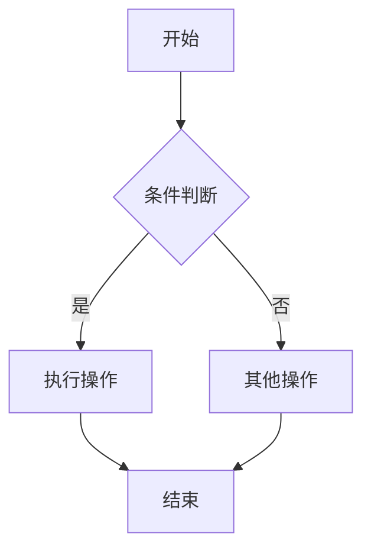
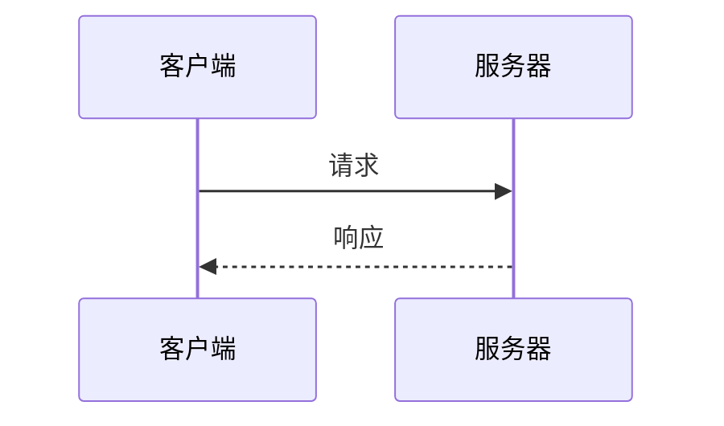
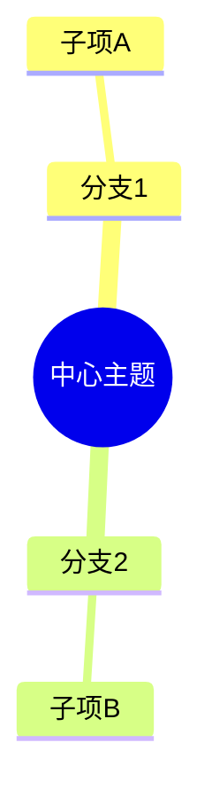

# Constella 编辑器使用指南

本指南覆盖 Constella 画布中编辑器的当前能力，重点包括：

- Markdown / Text 编辑
- 快捷命令与结构化插入
- 预览渲染与大文档体验
- 数学公式、Mermaid 与代码高亮
- 协作光标、导出与高频快捷键

---

## 目录

- [编辑器界面与工作模式](#编辑器界面与工作模式)
- [输入体验与智能编辑](#输入体验与智能编辑)
- [快捷命令 (/)](#快捷命令-)
- [工具栏与结构化编辑](#工具栏与结构化编辑)
- [预览渲染与联动](#预览渲染与联动)
- [数学公式](#数学公式)
- [Mermaid 图表](#mermaid-图表)
- [代码高亮](#代码高亮)
- [协作编辑](#协作编辑)
- [导出与键盘快捷键](#导出与键盘快捷键)
- [实践建议](#实践建议)

---

## 编辑器界面与工作模式

编辑器提供三种视图模式（Markdown 节点可用）：

- `Edit`：仅编辑区
- `Split`：编辑区 + 预览区
- `Preview`：仅预览区

核心界面元素：

- 顶部模式切换按钮（Edit/Split/Preview）
- 轻量工具栏（标题、列表、引用、代码块、数学公式、表格、链接、Mermaid）
- 代码块语言胶囊（光标位于 fenced code block 内时显示）
- 预览区统计（blocks / headings）
- 预览区左侧悬浮 Outline 收纳条
- 右下角 Back to Top（根据当前模式作用于编辑区、预览区或两者）

说明：

- Text 节点使用纯文本编辑能力，不显示 Markdown 相关预览组件。
- Markdown 节点默认支持渲染与结构化导航。

---

## 输入体验与智能编辑

编辑器支持以下高频输入增强：

### 成对符号与包裹

- 自动补全常见成对符号：`()`, `{}`, `""`, `''`, `` `...` ``, `$...$`
- 当有选中文本时，可直接使用以下按键包裹：
  - `*`（加粗包裹）
  - `` ` ``（行内代码）
  - `$`（行内数学）
  - `[`（快速链接包裹）

### 列表与引用自动续写

按 `Enter` 时会根据当前行自动续写结构：

- 无序列表：`- ` / `* ` / `+ `
- 有序列表：`1. `（自动递增）
- Todo：`- [ ] `
- 引用：`> `

### 缩进与反缩进

- `Tab`：当前行或选中多行缩进
- `Shift + Tab`：当前行或选中多行反缩进

### 智能粘贴

- 选中文本后粘贴 URL：自动生成 Markdown 链接
- 粘贴多行代码样式文本：自动包裹为 fenced code block

---

## 快捷命令 (/)

在编辑器中输入 `/` 可唤出命令菜单，支持搜索与键盘导航。

### 基础命令

| 命令     | 快捷输入    | 说明         |
| -------- | ----------- | ------------ |
| 一级标题 | `/h1`       | `# 标题`     |
| 二级标题 | `/h2`       | `## 标题`    |
| 三级标题 | `/h3`       | `### 标题`   |
| 无序列表 | `/bullet`   | `- 列表项`   |
| 有序列表 | `/numbered` | `1. 列表项`  |
| 待办事项 | `/todo`     | `- [ ] 任务` |
| 引用     | `/quote`    | `> 引用文本` |
| 分割线   | `/divider`  | `---`        |

### 文本格式

| 命令   | 快捷输入  | 效果           |
| ------ | --------- | -------------- |
| 粗体   | `/bold`   | `**粗体文本**` |
| 斜体   | `/italic` | `*斜体文本*`   |
| 删除线 | `/strike` | `~~删除线~~`   |
| 链接   | `/link`   | `[文本](url)`  |
| 图片   | `/image`  | `` |
| 表格   | `/table`  | 插入表格模板   |

### 代码块

| 命令       | 快捷输入     | 语言       |
| ---------- | ------------ | ---------- |
| 代码块     | `/code`      | 通用       |
| JavaScript | `/code-js`   | JavaScript |
| TypeScript | `/code-ts`   | TypeScript |
| Python     | `/code-py`   | Python     |
| Java       | `/code-java` | Java       |
| CSS        | `/code-css`  | CSS        |
| HTML       | `/code-html` | HTML       |
| SQL        | `/code-sql`  | SQL        |
| Shell      | `/code-sh`   | Bash/Shell |
| JSON       | `/code-json` | JSON       |

### 数学公式

| 命令     | 快捷输入      | 说明         |
| -------- | ------------- | ------------ |
| 行内公式 | `/math`       | `$E = mc^2$` |
| 块级公式 | `/math-block` | `$$...$$`    |

### Mermaid 命令

| 命令     | 快捷输入               | 说明               |
| -------- | ---------------------- | ------------------ |
| 流程图   | `/mermaid-flow`        | Flowchart 模板     |
| 时序图   | `/mermaid-seq`         | Sequence 模板      |
| 思维导图 | `/mermaid-mindmap`     | Mindmap 模板       |
| 类图     | `/mermaid-class`       | Class Diagram 模板 |
| 状态图   | `/mermaid-state`       | State Diagram 模板 |
| ER 图    | `/mermaid-er`          | ER Diagram 模板    |
| 甘特图   | `/mermaid-gantt`       | Gantt 模板         |
| 用户旅程 | `/mermaid-journey`     | Journey 模板       |
| 饼图     | `/mermaid-pie`         | Pie 模板           |
| Git 图   | `/mermaid-gitgraph`    | GitGraph 模板      |
| 时间线   | `/mermaid-timeline`    | Timeline 模板      |
| 象限图   | `/mermaid-quadrant`    | Quadrant 模板      |
| 需求图   | `/mermaid-requirement` | Requirement 模板   |

---

## 工具栏与结构化编辑

除 `/` 命令外，Markdown 编辑器顶部工具栏也可快速插入结构：

- 标题（H1/H2）
- 列表（无序 / Todo）
- 引用
- 代码块
- 数学公式
- 表格
- 链接
- Mermaid Flow 模板

当光标位于 fenced code block 内部时，会出现代码语言胶囊（如 `javascript`、`typescript`、`python` 等），可一键修改当前代码块语言。

---

## 预览渲染与联动

### 预览渲染策略

- Markdown 按块切分渲染，而不是始终整篇重渲染。
- 代码块、表格、Mermaid、数学公式等重块支持延迟渲染（Lazy Render）。
- Mermaid 与 KaTeX 会在预览区自动渲染。

### 编辑区与预览区联动

- 编辑区滚动时，预览区按文档块位置同步跟随。
- 点击预览区中的内容块，可回定位到编辑区对应位置。
- Outline 根据当前预览位置自动高亮，并支持点击跳转。

### 链接与图片行为

- 预览区超链接优先在外部浏览器打开。
- 图片支持点击放大预览。
- 图片加载失败时会显示可读的降级提示。

---

## 数学公式

使用 [KaTeX](https://katex.org/) 渲染 LaTeX 数学公式。

### 基本语法

```markdown
行内公式：$E = mc^2$

块级公式：
$$
\int_{a}^{b} f(x) \, dx
$$
```

### 常用结构

#### 分数

```latex
$\frac{a}{b}$
$\dfrac{a}{b}$
$\tfrac{a}{b}$
```

#### 上下标

```latex
$x^2$
$x_i$
$x_i^2$
$x^{2n}$
```

#### 矩阵

```latex
$$
\begin{pmatrix}
a & b \\
c & d
\end{pmatrix}
$$
```

#### 分段函数

```latex
$$
f(x) = \begin{cases}
x^2 & x \geq 0 \\
-x^2 & x < 0
\end{cases}
$$
```

---

## Mermaid 图表

使用 [Mermaid](https://mermaid.js.org/) 创建图表。

### 流程图 (Flowchart)

````markdown

```mermaid
flowchart TD
    A[开始] --> B{条件判断}
    B -->|是| C[执行操作]
    B -->|否| D[其他操作]
    C --> E[结束]
    D --> E
```
````

### 时序图 (Sequence Diagram)

````markdown

```mermaid
sequenceDiagram
    participant A as 客户端
    participant B as 服务器
    A->>B: 请求
    B-->>A: 响应
```
````

### 思维导图 (Mindmap)

````markdown

```mermaid
mindmap
  root((中心主题))
    分支1
      子项A
    分支2
      子项B
```
````

### 其他常用类型

- Class Diagram
- State Diagram
- ER Diagram
- Gantt
- Journey
- Pie
- GitGraph
- Timeline
- Quadrant
- Requirement Diagram

建议优先通过 `/mermaid-*` 命令插入模板，再按业务内容修改。

---

## 代码高亮

编辑器支持多语言语法高亮，并在预览代码块顶部显示语言标签。

### 使用方法

````markdown
```typescript
function hello(name: string) {
    console.log(`Hello, ${name}`)
}
```
````

### 常用语言标识

| 语言标识            | 语言         |
| ------------------- | ------------ |
| `javascript` / `js` | JavaScript   |
| `typescript` / `ts` | TypeScript   |
| `python` / `py`     | Python       |
| `java`              | Java         |
| `go`                | Go           |
| `rust`              | Rust         |
| `html`              | HTML         |
| `css` / `scss`      | CSS / SCSS   |
| `sql`               | SQL          |
| `bash` / `shell`    | Bash / Shell |
| `json`              | JSON         |
| `yaml`              | YAML         |

说明：浅色与深色主题下代码块会自动使用对应样式。

---

## 协作编辑

在多人协作场景下，编辑器支持：

- 远端协作者光标实时显示
- 远端协作者选区高亮
- 编辑器顶部显示当前协作用户头像标识

这有助于降低同一区域同时编辑时的冲突成本。

---

## 导出与键盘快捷键

### 导出

编辑器支持文档导出面板：

- Markdown：`PDF` / `Markdown` / `Text`
- Text：`Text`（以及支持环境下的 PDF 流程）

可配置导出文件名、主题、方向等参数（按运行环境可用性显示）。

### 键盘快捷键

| 快捷键          | 功能                     |
| --------------- | ------------------------ |
| `/`             | 打开命令菜单             |
| `↑` / `↓`       | 命令菜单导航             |
| `Enter` / `Tab` | 执行当前命令             |
| `Esc`           | 关闭命令菜单或关闭编辑器 |
| `Tab`           | 当前行/多行缩进          |
| `Shift + Tab`   | 当前行/多行反缩进        |
| `Enter`         | 在列表/引用中自动续写    |

---

## 实践建议

1. 先用工具栏搭结构，再补正文内容，效率更高。
2. 复杂文档优先使用 `Split` 模式，便于边写边核对渲染结果。
3. Mermaid 建议从模板命令插入，减少语法错误。
4. 大文档编辑时，多利用 Outline 快速定位章节。
5. 协作场景下先观察远端光标区域，减少覆盖修改。

---

*Constella Team © 2026*
