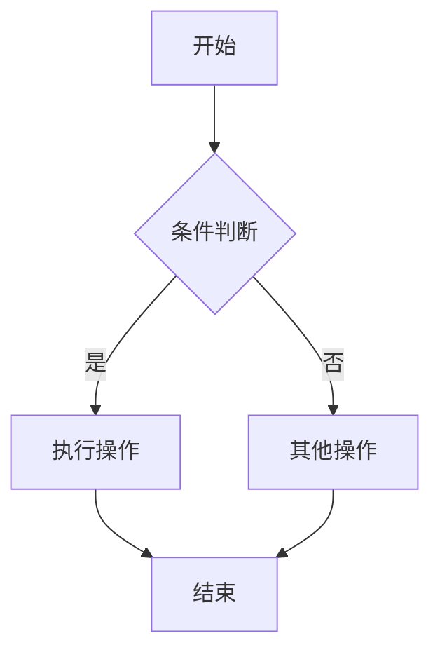
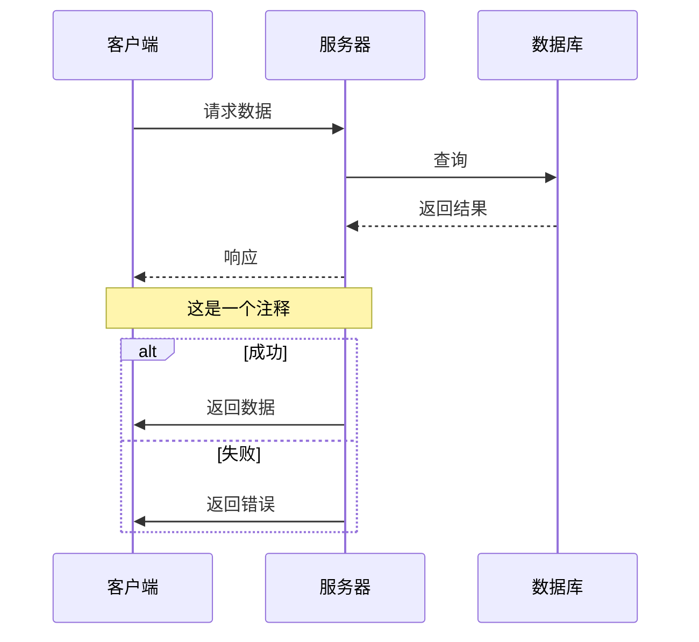
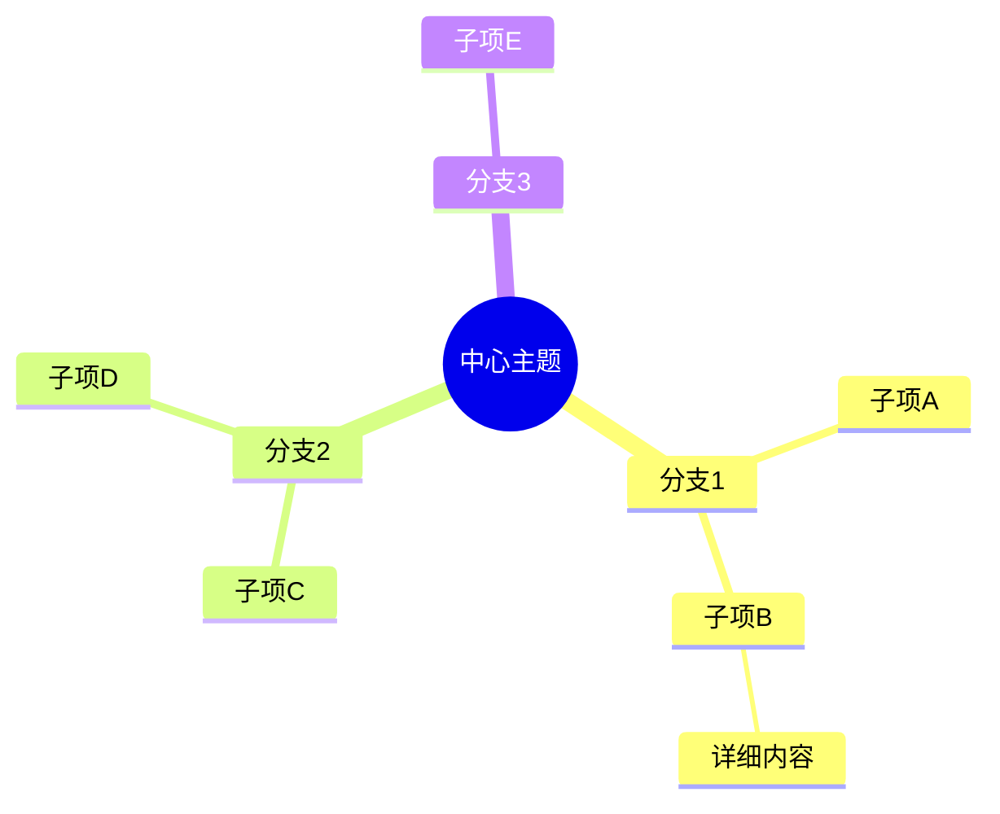
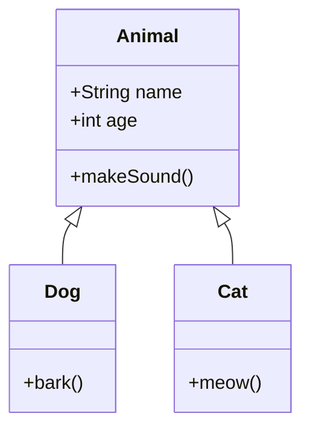
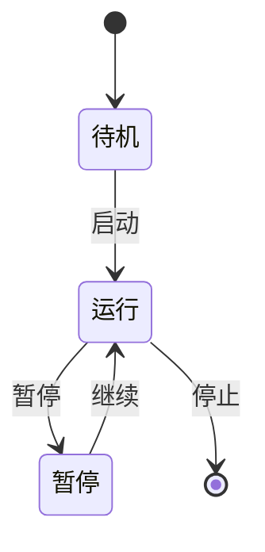
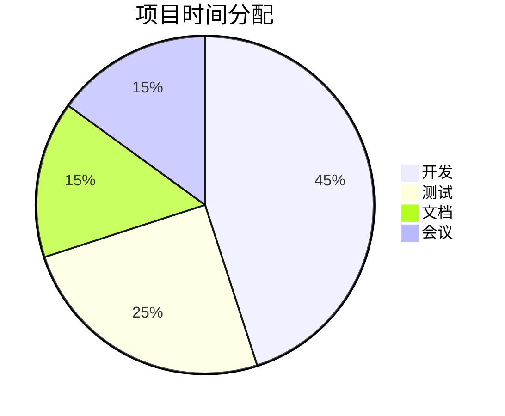

# Constella Markdown 编辑器使用指南

本指南介绍 Constella 画布中 Markdown 编辑器的各种功能和快捷操作。

---

## 目录

- [快捷命令 (/)](#快捷命令-)
- [数学公式](#数学公式)
- [Mermaid 图表](#mermaid-图表)
- [代码高亮](#代码高亮)

---

## 快捷命令 (/)

在编辑器中输入 `/` 可唤出命令菜单，支持搜索和键盘导航。

### 基础命令

| 命令 | 快捷输入 | 说明 |
|------|----------|------|
| 一级标题 | `/h1` | `# 标题` |
| 二级标题 | `/h2` | `## 标题` |
| 三级标题 | `/h3` | `### 标题` |
| 无序列表 | `/bullet` | `- 列表项` |
| 有序列表 | `/numbered` | `1. 列表项` |
| 待办事项 | `/todo` | `- [ ] 任务` |
| 引用 | `/quote` | `> 引用文本` |
| 分割线 | `/divider` | `---` |

### 文本格式

| 命令 | 快捷输入 | 效果 |
|------|----------|------|
| 粗体 | `/bold` | **粗体文本** |
| 斜体 | `/italic` | *斜体文本* |
| 删除线 | `/strike` | ~~删除线~~ |
| 链接 | `/link` | `[文本](url)` |
| 图片 | `/image` | `` |
| 表格 | `/table` | 插入表格模板 |

### 代码块

| 命令 | 快捷输入 | 语言 |
|------|----------|------|
| 代码块 | `/code` | 通用代码块 |
| JavaScript | `/code-js` | JavaScript |
| TypeScript | `/code-ts` | TypeScript |
| Python | `/code-py` | Python |
| Java | `/code-java` | Java |
| CSS | `/code-css` | CSS |
| HTML | `/code-html` | HTML |
| SQL | `/code-sql` | SQL |
| Shell | `/code-sh` | Bash/Shell |
| JSON | `/code-json` | JSON |

### 数学公式

| 命令 | 快捷输入 | 说明 |
|------|----------|------|
| 行内公式 | `/math` | `$E = mc^2$` |
| 块级公式 | `/math-block` | `$$...$$` |

### 图表

| 命令 | 快捷输入 | 说明 |
|------|----------|------|
| 流程图 | `/mermaid-flow` | Mermaid 流程图 |
| 时序图 | `/mermaid-seq` | Mermaid 时序图 |
| 思维导图 | `/mermaid-mindmap` | Mermaid 思维导图 |

---

## 数学公式

使用 [KaTeX](https://katex.org/) 渲染 LaTeX 数学公式。

### 基本语法

```markdown
行内公式：$E = mc^2$

块级公式：
$$
\int_{a}^{b} f(x) \, dx
$$
```

### 常用符号速查表

#### 希腊字母

| 符号 | 代码 | 符号 | 代码 |
|------|------|------|------|
| α | `\alpha` | β | `\beta` |
| γ | `\gamma` | δ | `\delta` |
| ε | `\epsilon` | ζ | `\zeta` |
| η | `\eta` | θ | `\theta` |
| ι | `\iota` | κ | `\kappa` |
| λ | `\lambda` | μ | `\mu` |
| ν | `\nu` | ξ | `\xi` |
| π | `\pi` | ρ | `\rho` |
| σ | `\sigma` | τ | `\tau` |
| υ | `\upsilon` | φ | `\phi` |
| χ | `\chi` | ψ | `\psi` |
| ω | `\omega` | Φ | `\Phi` |
| Ψ | `\Psi` | Ω | `\Omega` |

#### 运算符

| 符号 | 代码 | 说明 |
|------|------|------|
| ± | `\pm` | 加减 |
| × | `\times` | 乘号 |
| ÷ | `\div` | 除号 |
| · | `\cdot` | 点乘 |
| ∑ | `\sum` | 求和 |
| ∏ | `\prod` | 求积 |
| ∫ | `\int` | 积分 |
| ∬ | `\iint` | 二重积分 |
| ∮ | `\oint` | 环路积分 |
| ∂ | `\partial` | 偏导数 |
| ∇ | `\nabla` | 梯度 |
| √ | `\sqrt{}` | 平方根 |
| ∛ | `\sqrt[3]{}` | 立方根 |

#### 关系符号

| 符号 | 代码 | 说明 |
|------|------|------|
| ≤ | `\le` 或 `\leq` | 小于等于 |
| ≥ | `\ge` 或 `\geq` | 大于等于 |
| ≠ | `\ne` 或 `\neq` | 不等于 |
| ≈ | `\approx` | 约等于 |
| ≡ | `\equiv` | 恒等于 |
| ∝ | `\propto` | 正比于 |
| ∈ | `\in` | 属于 |
| ∉ | `\notin` | 不属于 |
| ⊂ | `\subset` | 真子集 |
| ⊆ | `\subseteq` | 子集 |
| ∪ | `\cup` | 并集 |
| ∩ | `\cap` | 交集 |
| ∅ | `\emptyset` | 空集 |

#### 箭头

| 符号 | 代码 | 符号 | 代码 |
|------|------|------|------|
| → | `\to` 或 `\rightarrow` | ← | `\leftarrow` |
| ⇒ | `\Rightarrow` | ⇐ | `\Leftarrow` |
| ↔ | `\leftrightarrow` | ⇔ | `\Leftrightarrow` |
| ↑ | `\uparrow` | ↓ | `\downarrow` |
| ↦ | `\mapsto` | ∞ | `\infty` |

#### 特殊符号

| 符号 | 代码 | 说明 |
|------|------|------|
| ∀ | `\forall` | 任意 |
| ∃ | `\exists` | 存在 |
| ∄ | `\nexists` | 不存在 |
| ℕ | `\mathbb{N}` | 自然数集 |
| ℤ | `\mathbb{Z}` | 整数集 |
| ℚ | `\mathbb{Q}` | 有理数集 |
| ℝ | `\mathbb{R}` | 实数集 |
| ℂ | `\mathbb{C}` | 复数集 |

### 常用结构

#### 分数

```latex
$\frac{a}{b}$           % 普通分数
$\dfrac{a}{b}$          % 大分数（display style）
$\tfrac{a}{b}$          % 小分数（text style）
```

#### 上下标

```latex
$x^2$                   % 上标
$x_i$                   % 下标
$x_i^2$                 % 同时使用
$x^{2n}$                % 多字符上标
${}_a^b X$              % 左侧上下标
```

#### 括号

```latex
$(a+b)$                 % 小括号
$[a+b]$                 % 中括号
$\{a+b\}$               % 大括号
$\left(\frac{a}{b}\right)$  % 自适应大小
$\langle a \rangle$     % 尖括号
$|x|$                   % 绝对值
$\|x\|$                 % 范数
```

#### 矩阵

```latex
$$
\begin{pmatrix}
a & b \\
c & d
\end{pmatrix}
$$

$$
\begin{bmatrix}
1 & 2 & 3 \\
4 & 5 & 6
\end{bmatrix}
$$
```

#### 多行公式

```latex
$$
\begin{aligned}
f(x) &= x^2 + 2x + 1 \\
     &= (x+1)^2
\end{aligned}
$$
```

#### 分段函数

```latex
$$
f(x) = \begin{cases}
x^2 & x \geq 0 \\
-x^2 & x < 0
\end{cases}
$$
```

### 常用公式示例

```latex
% 二次公式
$x = \frac{-b \pm \sqrt{b^2-4ac}}{2a}$

% 欧拉公式
$e^{i\pi} + 1 = 0$

% 极限
$\lim_{n \to \infty} \frac{1}{n} = 0$

% 求和
$\sum_{i=1}^{n} i = \frac{n(n+1)}{2}$

% 积分
$\int_0^{\infty} e^{-x^2} dx = \frac{\sqrt{\pi}}{2}$

% 偏导数
$\frac{\partial f}{\partial x}$

% 向量
$\vec{v} = \langle x, y, z \rangle$

% 矩阵乘法
$\mathbf{A} \cdot \mathbf{B}$
```

---

## Mermaid 图表

使用 [Mermaid](https://mermaid.js.org/) 创建各种图表。

### 流程图 (Flowchart)

````markdown

````

#### 节点形状

```
[矩形]      ([圆角矩形])    ((圆形))
{菱形}      {{六边形}}      [/平行四边形/]
[\梯形/]    [(圆柱)]        [[子程序]]
```

#### 连线样式

```
A --> B     % 实线箭头
A --- B     % 实线无箭头
A -.-> B    % 虚线箭头
A ==> B     % 粗线箭头
A --文字--> B   % 带文字
```

#### 方向

```
TB/TD   % 从上到下
BT      % 从下到上
LR      % 从左到右
RL      % 从右到左
```

### 时序图 (Sequence Diagram)

````markdown

````

#### 消息类型

```
->>     % 实线箭头
-->>    % 虚线箭头
-x      % 实线叉号
--x     % 虚线叉号
-)      % 实线开放箭头
--)     % 虚线开放箭头
```

### 思维导图 (Mindmap)

````markdown

````

### 类图 (Class Diagram)

````markdown

````

### 状态图 (State Diagram)

````markdown

````

### 饼图 (Pie Chart)

````markdown

````

### 甘特图 (Gantt)

````markdown
```mermaid
gantt
    title 项目计划
    dateFormat YYYY-MM-DD
    section 阶段1
    任务1: 2024-01-01, 30d
    任务2: after 任务1, 20d
    section 阶段2
    任务3: 2024-02-01, 25d
```
````

---

## 代码高亮

支持多种编程语言的语法高亮。

### 使用方法

````markdown
```javascript
function hello() {
    console.log("Hello, World!");
}
```
````

### 支持的语言

| 语言标识 | 语言 |
|----------|------|
| `javascript` / `js` | JavaScript |
| `typescript` / `ts` | TypeScript |
| `python` / `py` | Python |
| `java` | Java |
| `c` / `cpp` | C/C++ |
| `csharp` / `cs` | C# |
| `go` | Go |
| `rust` | Rust |
| `php` | PHP |
| `ruby` | Ruby |
| `swift` | Swift |
| `kotlin` | Kotlin |
| `html` | HTML |
| `css` | CSS |
| `scss` / `sass` | SCSS/Sass |
| `sql` | SQL |
| `bash` / `shell` | Bash/Shell |
| `json` | JSON |
| `yaml` | YAML |
| `xml` | XML |
| `markdown` / `md` | Markdown |

---

## 键盘快捷键

| 快捷键 | 功能 |
|--------|------|
| `/` | 打开命令菜单 |
| `↑` / `↓` | 命令菜单导航 |
| `Enter` / `Tab` | 执行选中命令 |
| `Esc` | 关闭菜单/编辑器 |

---

## 提示

1. **公式预览**: 编辑器右侧会实时预览渲染效果
2. **命令搜索**: 输入 `/` 后可继续输入关键词搜索命令
3. **智能光标**: 插入代码块或公式块后，光标会自动定位到内容区域
4. **协作编辑**: 可以看到其他用户的光标位置和选区

---

*Constella Team © 2026*
