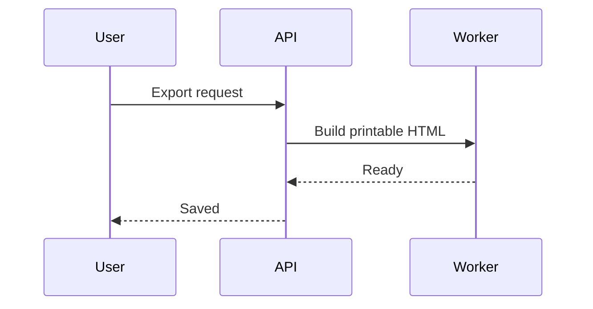
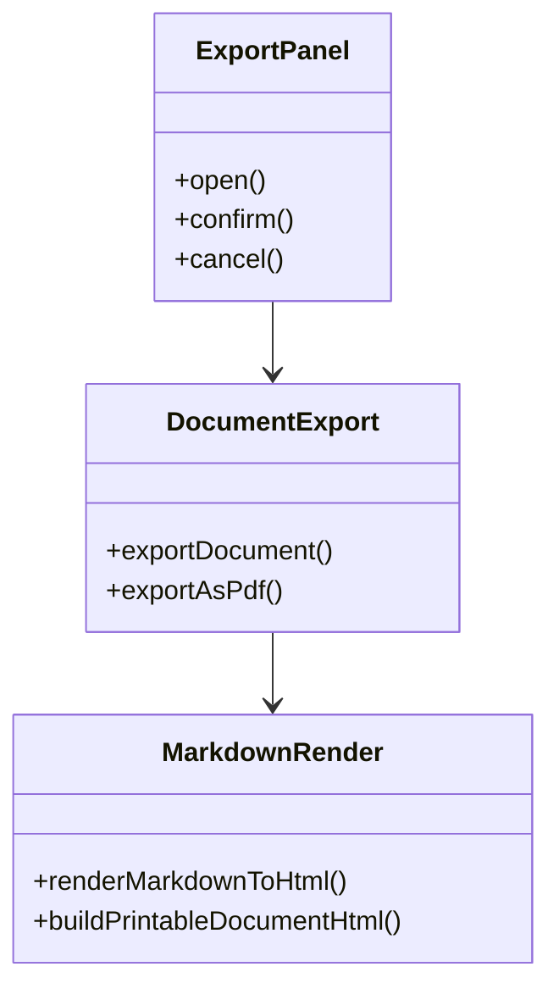
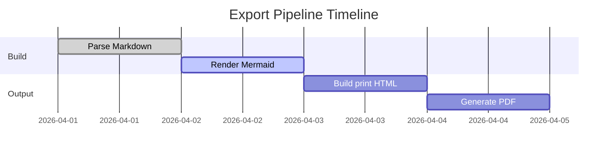

# Mermaid Multi-Block Fixture (PDF Export)

Use this fixture to validate placement, spacing, and pagination when multiple Mermaid blocks are close together.

## 1. Purpose

This file helps you evaluate:

- Vertical rhythm between consecutive Mermaid wrappers.
- Whether compact spacing reduces dead space usefully.
- Whether page-break strategy feels predictable.

## 2. Block A

## 3. Block B

## 4. Block C

## 5. Observation Notes

- Check top and bottom whitespace around each Mermaid block.
- Check if one large block pushes small blocks awkwardly.
- Check whether compact mode is still readable for labels.
