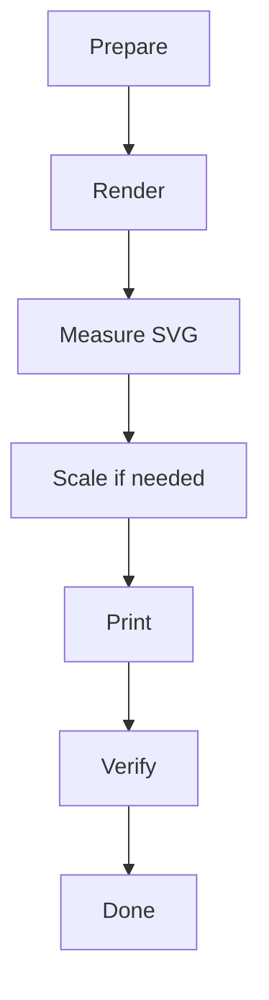

# Mermaid Page-Boundary Fixture (PDF Export)

Use this fixture to validate behavior when Mermaid appears near page boundaries.

## 1. Intro Paragraphs

This section intentionally adds enough text to move the first Mermaid block close to a page boundary in A4 portrait mode.

Paragraph 1: export stability under realistic note length.

Paragraph 2: export stability under realistic note length.

Paragraph 3: export stability under realistic note length.

Paragraph 4: export stability under realistic note length.

Paragraph 5: export stability under realistic note length.

Paragraph 6: export stability under realistic note length.

Paragraph 7: export stability under realistic note length.

Paragraph 8: export stability under realistic note length.

Paragraph 9: export stability under realistic note length.

Paragraph 10: export stability under realistic note length.

## 2. Boundary Mermaid

## 3. Follow-up Content

Add this content to detect if layout jumps unexpectedly after Mermaid placement.

- Item 1
- Item 2
- Item 3
- Item 4
- Item 5

## 4. Observation Notes

- With Move to next page, check if the entire diagram starts on a clean page.
- With Auto scale, check if it stays with nearby context naturally.
- Confirm no overlap with headers/footers in print output.
