# Mermaid Tall Fixture (PDF Export)

Use this fixture to validate very tall Mermaid diagrams under these settings:

- Large Mermaid charts: Auto scale / Move to next page
- Mermaid scaling: Fit page / Fit width
- Mermaid spacing: Standard / Compact

## 1. Purpose

This file emphasizes vertical pressure. It helps you evaluate:

- Whether a very tall graph is clipped in PDF.
- Whether Auto scale keeps text readable.
- Whether Move to next page avoids awkward mid-content placement.

## 2. Tall Flowchart

```mermaid
flowchart TD
    N01[Step 01] --> N02[Step 02]
    N02 --> N03[Step 03]
    N03 --> N04[Step 04]
    N04 --> N05[Step 05]
    N05 --> N06[Step 06]
    N06 --> N07[Step 07]
    N07 --> N08[Step 08]
    N08 --> N09[Step 09]
    N09 --> N10[Step 10]
    N10 --> N11[Step 11]
    N11 --> N12[Step 12]
    N12 --> N13[Step 13]
    N13 --> N14[Step 14]
    N14 --> N15[Step 15]
    N15 --> N16[Step 16]
    N16 --> N17[Step 17]
    N17 --> N18[Step 18]
    N18 --> N19[Step 19]
    N19 --> N20[Step 20]
    N20 --> N21[Step 21]
    N21 --> N22[Step 22]
    N22 --> N23[Step 23]
    N23 --> N24[Step 24]
    N24 --> N25[Step 25]
    N25 --> N26[Step 26]
    N26 --> N27[Step 27]
    N27 --> N28[Step 28]
    N28 --> N29[Step 29]
    N29 --> N30[Step 30]
```

## 3. Observation Notes

- Check if the bottom nodes remain visible.
- Check if labels become too small when scaled.
- Check if spacing mode changes readability materially.
