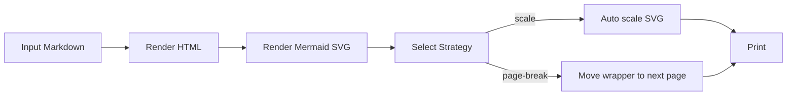

# Mermaid PDF Tuning Baseline

This fixture is used with a fixed review checklist to tune these values in markdownRender:

- minScale
- --mermaid-content-max-height
- Mermaid wrapper spacing variables

## 1. Baseline Diagram

## 2. Checklist

For each export run, capture:

- Setting tuple: oversize / scale mode / density / orientation.
- Readability score (1-5) for Mermaid labels.
- Space efficiency score (1-5).
- Any clipping or overflow issue.
- Any awkward page transition.

## 3. Recommended Run Order

1. Portrait + Auto scale + Fit page + Compact.
2. Portrait + Auto scale + Fit width + Compact.
3. Portrait + Move to next page + Fit page + Standard.
4. Landscape + Auto scale + Fit page + Compact.
5. Landscape + Move to next page + Fit width + Standard.

## 4. Decision Gate

If readability drops below 3/5 in at least two runs, revisit minScale first.
If clipping appears in any run, revisit max-height and scaling policy.
If whitespace feels excessive in three or more runs, tighten wrapper spacing.
