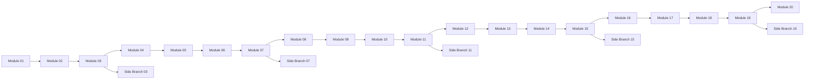

# Mermaid Wide Fixture (PDF Export)

Use this fixture to validate very wide Mermaid diagrams.

## 1. Purpose

This file emphasizes horizontal pressure. It helps you evaluate:

- Fit width behavior on wide graph structures.
- Fit page behavior when both width and height are constrained.
- Whether right-side nodes are clipped.

## 2. Wide Dependency Graph

## 3. Observation Notes

- Compare Fit width vs Fit page legibility.
- Verify no clipped labels at the far right.
- Verify wrapper spacing does not waste too much area.
